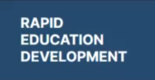
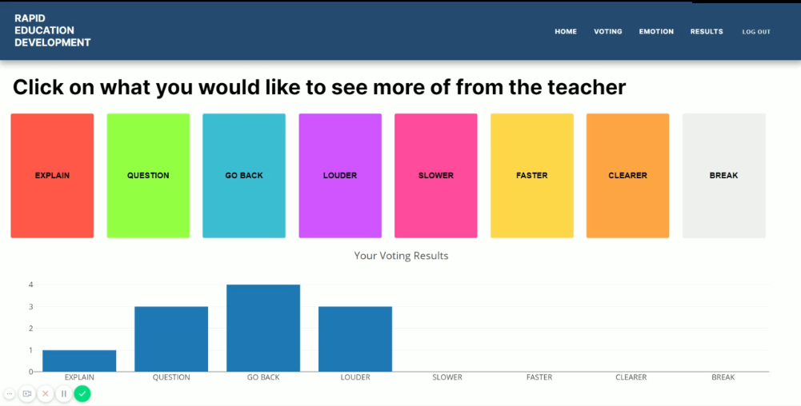

 

  

  <h3 align="center">Interactive Classroom</h3>

  

    A website which allows students to rate teacher performance and allows teachers to see students engagement in lessons.
     
  

<!-- TABLE OF CONTENTS -->
## Table of Contents

* [About the Project](#about-the-project)
  * [Built With](#built-with)
* [Getting Started](#getting-started)
  * [Prerequisites](#prerequisites)
  * [Installation](#installation)
* [Usage](#usage)
* [Roadmap](#roadmap)
* [Contributing](#contributing)
* [License](#license)
* [Contact](#contact)
* [Acknowledgements](#acknowledgements)

<!-- ABOUT THE PROJECT -->
## About The Project

    

 

The goal of the project was to create website where students can login to rooms created by a teacher to vote on the performance of the teacher. Teacher are voted against eight different categories which are designed to give the teacher feedback on how to better meet the needs of the students in the room. Some of these categories include; question - used to indicate the students have a question to ask the teacher and slow down used to tell the teacher to slow the lesson down.

Here's why:
* Literacture review conducted by me found that students were not comfortable raising thier hands in front of 200+ students in a lecture hall.
* A teacher is not able to cater to the needs of all students due to the size of the classroom.
* Methods existed to improve active recall and interaction in lessons but none to convey the needds of the students in the classroom in real-time.

The finished product also included a emotion recognition which had it's own dedicated page. This utilised the AWS Rekognition API to analyse the emotion expressed by a particular student upon the teacher's request.

### Built With
These are the major frameworks / add-ons / plugins used in the project.
* [AWS Rekognition](https://aws.amazon.com/rekognition)
* [AWS WebSockets with Lambda](https://aws.amazon.com/lambda/)
* [Github](https://github.com)

## Getting Started

As it stands, you will not be able to run the project unless you have an AWS account and set up DynamoDB, WebSockets, Lambda and more.

<!-- LICENSE -->
## License

Distributed under the MIT License. See `LICENSE` for more information.

<!-- CONTACT -->
## Contact

Project Link: [Final Year Project](https://github.com/chenshanmugarajah/final-year-project)

<!-- ACKNOWLEDGEMENTS -->
## Acknowledgements
* [AWS Rekognition](https://aws.amazon.com/rekognition)
* [AWS WebSockets with Lambda](https://aws.amazon.com/lambda/)
* [Github](https://github.com)